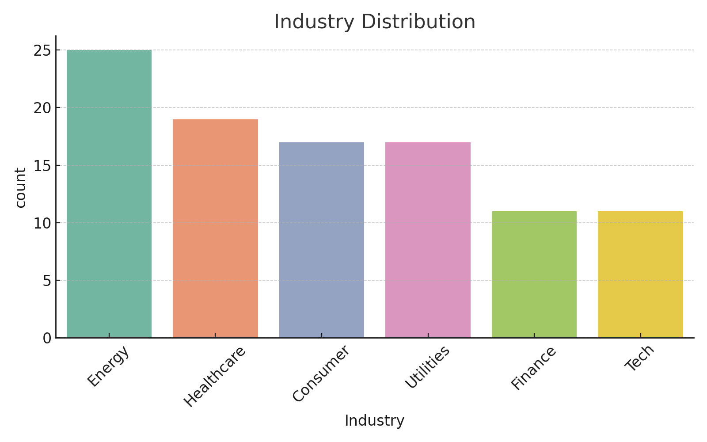

# Financial Health & Risk Dashboard

This project analyzes financial KPIs (like ROE, ROA, Debt/Equity) across multiple industries and builds a machine learning model to classify companies as high-risk or healthy based on simulated financial data.

---

## Objective

- Analyze profitability, liquidity, leverage, and growth metrics across industries
- Train a binary classifier to detect financially at-risk companies
- Visualize KPIs, industry patterns, and model-driven insights

---

## Tools Used

- Python (Pandas, NumPy, Matplotlib, Seaborn)
- Scikit-learn: Random Forest Classifier
- Jupyter Notebook
- Simulated financial dataset

---

## Key Features

- Exploratory Data Analysis on core KPIs  
- Correlation heatmap of financial metrics  
- Random Forest classifier to flag risky companies  
- Feature importance ranking for explainability  

---

## Files Included

- `Financial Risk & KPI Analysis.ipynb` – Full code: EDA, modeling, plots  
- `financial_kpi_dataset.csv` – Simulated company-level data  
- `industry_distribution.png` – Distribution of companies by sector  
- `kpi_distributions.png` – Histogram of key financial KPIs  
- `correlation_matrix.png` – Heatmap of KPI correlations  
- `feature_importance.png` – Key drivers of financial risk

---

## Sample Visuals

### 1. Industry Distribution

### 2. KPI Distributions

### 3. Correlation Matrix

### 4. Feature Importance

---

##  Dataset Source

This dataset was synthetically generated for demonstration and educational use.  
It simulates 100 companies across industries using realistic financial ratios.

---

